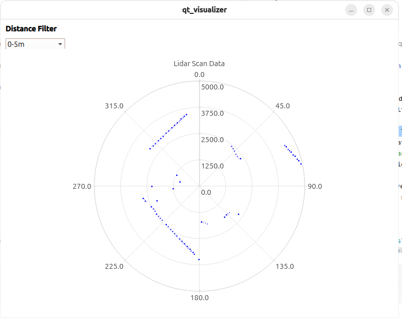

# SLAM and lidar exploration

# Slamtec RPLidar visualization

In this part I wanted to play with mechanical 2D lidar from Slamtec - show basic
scan data in a plot without third-party software (except for QT and SDK) with
something like that:



This comes with three workflows:

* Visualize real-time data in a polar plot
* Saving one scan into proto text format
* Visualizing previously saved data into a plot

## Setup

For visualization set up my other [project](https://github.com/bashtavenko/qt_visualizer) and
launch it in a separate terminal.

Install SDK `.\install_rpildiar.sh`. More details on this later

Configure USB. Check `ls /dev/ttyUSB*` to see the available port. You need a `chmod` permission
or probably `dialout`.

## Visualization

If visualizer is running in a separate terminal, this shows real-time data from lidar

```shell
blaze run //:runner_main -- --usb_port=/dev/ttyUSB0 --visualizer_port=9000
```

if one scan was previously saved, launch this to show it

```shell
 blaze run //:runner_main -- in_path=testdata/lidar.txtpb --visualizer_port=9000
```

## Saving one scan data

Run this or use file in `testdata`:

```shell
blaze run //:runner_main -- --usb_port=/dev/ttyUSB0 --out_path=/tmp/lidar.txtpb
```

## More info

Slamtec [SDK](https://github.com/Slamtec/rplidar_sdk) has the latest release in 2019 and the main branch was completely
out of sync [issue](https://github.com/Slamtec/rplidar_sdk/issues/136). To get things moving
I [forked](https://github.com/bashtavenko/rplidar_sdk) their SDK with
fresh release url of 2025.

The SDK has an ancient makefile. Bazel has a make rule in `rules_foreign_cc` but I could not make it
working - [issue](https://github.com/bazelbuild/bazel/issues/24880).
In order to work around I made a shell script that produces headers and static libraries in `third_party`.

As I [mentioned](https://github.com/bashtavenko/qt_visualizer) I did not want for QT to usurp my project, I just wanted
to have a quick fire-and-forget visualization in a simple polar chars.